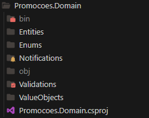
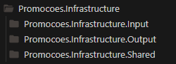
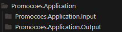
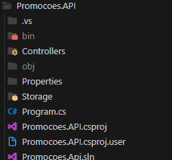

# Entendendo decisões arquiteturais e a estrutura do projeto

## Resumo do projeto
- A principal ideia do projeto é criar uma aplicação pra resolver um "problema" da minha cidade, onde pequenas empresas/negocios enfrentão dificuldade em divulgar ou apresentar seus produtos.

## Requisitos para rodar o projeto

### Setup de ambiente:

- [DOTNET](https://dotnet.microsoft.com/pt-br/)
  - Instale o [`dotnet`](https://github.com/nvm-sh/nvm)

### Como rodar na minha máquina?

- Clone o projeto `git clone https://github.com/RHamudi/project-promo-back.git`
- Selecione a pasta /Promocoes.API/
- Rode `dotnet run`
- Pronto 🎉

### Estrutura do projeto

Utilizei o padrão DDD (Domain-Driven Design) com CQRS (Command Query Responsibility Segregation) para desenvolver o projeto

- Optei por usar o DDD pois no inicio não decidi todas as funcionalidades do aplicativo, e ao decorrer do desenvolvimento pode ser preciso adicionar algumas features, e esse padrão facilita isso.

- Ja o CQRS eu resolvi utilizar pois o comando(Escrita) e a Query(leitura) na minha aplicação utiliza entidades diferentes, e isso poderia acabar adicionando uma complexidade a mais.

### Resumo da estrutura das pastas

- No domain está localizado todas entidades, validações e regras de negocio da aplicação.

- Na infrastructure é responsavel pela conexão com o banco e tambem com as consultas de escrita e leitura.
- Input responsavel por todas as querys de escrita;
- Output responsavel por todas as querys de leitura;
- Shared tem todos os metodos e classes que serão utilizadas em ambas as partes.

- Responsavel por fazer a comunicação entre as informações que vem da requisição com a paste de infrastructure. 

- Responvel por criar as rotas que o usuario terá acesso.
 
### obs

Essa não é a versão final da API, agora estou desenvolvendo a primeira versão do front end, nessa api ainda irei adicionar outras rotas e novas funcionalidades.

Atualmente essas são as rotas criadas:

### Novas funcionalidades que estão por vim

- Novas rotas para deletar empresa, product e promoção;
- Promoção ser deletada automaticamente quando acabar o prazo proposto na criação;
- Sistema de login com autenticação;
- Melhorar o sistema de envio de imagens em todas as rotas.